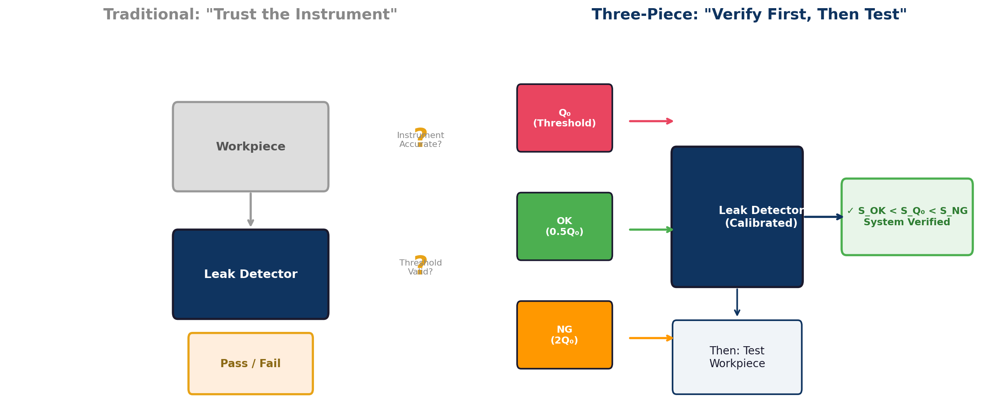
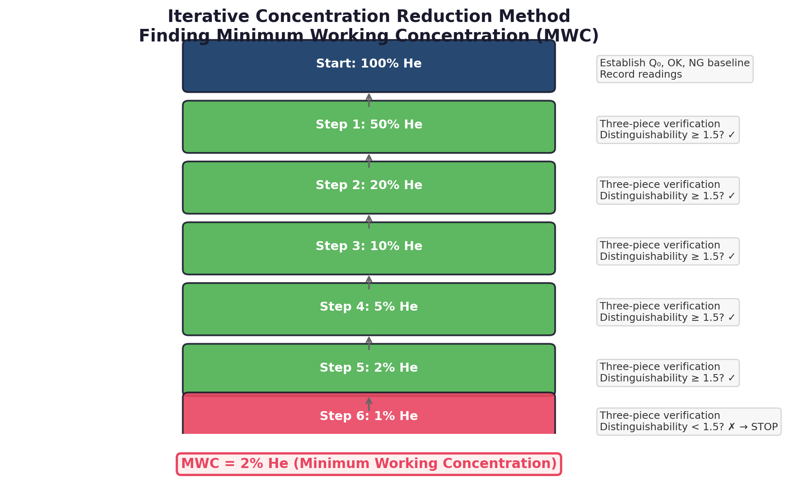
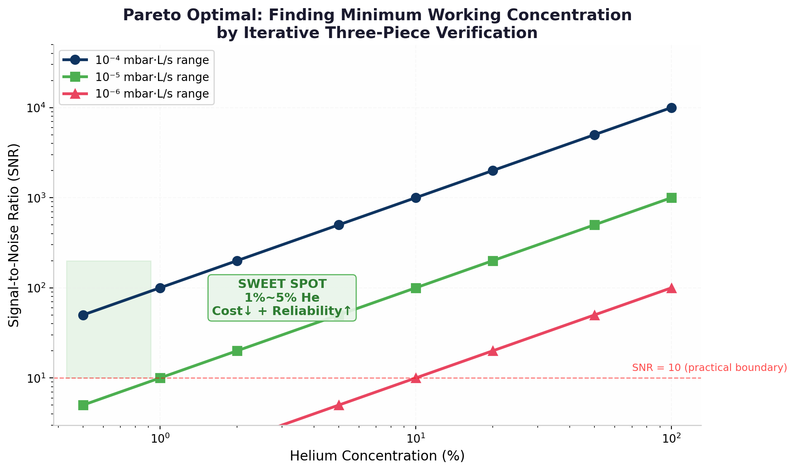

---

**TECHNICAL WHITE PAPER**

# Helium Leak Detection: An Essence Rediscovered, Comparing Leak Apertures — Three-Piece Verification and the Helium Reduction Paradigm Revolution

*Based on First Principles: Verification Determines Reliability, 10–100× Helium Reduction Is Merely a Side Effect*

**Shanghai RMI Instrument Co., Ltd.**
RealMeter Instruments (Shanghai)
V4.0 Final · Ten Chapters · July 2026

---

---

## Table of Contents

- Helium Leak Detection: An Essence Rediscovered, Comparing Leak Apertures — Three-Piece Verification and the Helium Reduction Paradigm Revolution
- [Chapter 1 Helium Supply Chain Crisis](#sec1)
  - [1.1 Middle East Geopolitical Shock and Qatar Facility Damage](#sec1-1)
  - [1.2 Global Helium Supply-Demand Dynamics](#sec1-2)
  - [1.3 China's Structural Helium Vulnerability](#sec1-3)
- [Chapter 2 Physical First Principles: Equivalent Aperture Comparison](#sec2)
  - [2.1 Three Cognitive Postures on Helium-Based Leak Detection](#sec2-1)
  - [2.2 Physical Reality: The Unchanging Equivalent Leak Aperture](#sec2-2)
  - [2.3 Four-Layer Framework: From Physical Reality to Instrument Reading](#sec2-3)
  - [2.4 The Binary Nature of Production-Line Leak Testing](#sec2-4)
  - [2.5 Air Leak Testers Have Already Proven: Non-Helium Works](#sec2-5)
  - [2.6 The Pure-Helium Myth: Concentration Anxiety vs. Reliability Anxiety](#sec2-6)
- [Chapter 3 Equivalent Aperture Comparative Method](#sec3)
  - [3.1 Two Dangerous Modes: Blind Faith in Instruments vs. Forced Helium Reduction](#sec3-1)
  - [3.2 Three-Piece Protocol (Q₀+OK+NG): The Gold Standard](#sec3-2)
  - [3.3 Feasibility and Core Conditions](#sec3-3)
  - [3.4 Concentration Reduction Iteration: Finding MWC](#sec3-4)
  - [3.5 Note on "Homologous Cancellation"](#sec3-5)
  - [3.6 Why Three-Piece Protocol Is Optimal Even at 100% He](#sec3-6)
- [Chapter 4 RMI-MTC™ Single-Capillary Reference Leak](#sec4)
  - [4.1 Technical Limitations of Conventional Reference Leaks](#sec4-1)
  - [4.2 RMI-MTC™ Single-Capillary and RMI-CAL Algorithm](#sec4-2)
  - [4.3 Performance Metrics and Metrological Traceability](#sec4-3)
- [Chapter 5 Active Noise Reduction via Low-Concentration Helium](#sec5)
  - [5.1 Causes and Quantification of Ambient Helium Contamination](#sec5-1)
  - [5.2 Elimination of Large-Leak Memory Effect](#sec5-2)
  - [5.3 Baseline Stability and Reduced False Alarm Rate](#sec5-3)
- [Chapter 6 Graded Helium Reduction: Three-Piece Validation as Final Authority](#sec6)
  - [6.1 10⁻⁴ mbar·L/s Range：Very Large Margin Interval](#sec6-1)
  - [6.2 10⁻⁵ mbar·L/s Range：Core Application Range](#sec6-2)
  - [6.3 10⁻⁶ mbar·L/s Range：Intervals Requiring Appropriate Concentration](#sec6-3)
  - [6.4 Honest Discussion of Flow-Regime Nonlinearity](#sec6-4)
  - [6.5 Common Customer Concerns: Gas Mixture Uniformity and Mixing Accuracy](#sec6-5)
- [Chapter 7 Implementation Roadmap](#sec7)
  - [7.1 Phase 1: Three-Piece Baseline (1–2 Weeks)](#sec7-1)
  - [7.2 Phase 2: Concentration Iteration (2–4 Weeks)](#sec7-2)
  - [7.3 Phase 3: Production Deployment & Monitoring](#sec7-3)
  - [7.4 Sniffer & Accumulation Method Implementation](#sec7-4)
- [Chapter 8 Economic Analysis](#sec8)
- [Chapter 9 Strategic Significance](#sec9)
  - [9.1 Cost Reduction+Efficiency Gain：Dual Transition](#sec9-1)
  - [9.2 Supply Chain Security: From "Begging to Buy" to "Being Begged to Buy"](#sec9-2)
  - [9.3 from"Catch Up"to"Definition Standard"](#sec9-3)
- [Chapter 10 Applicability, Risk Boundaries & Disclosures](#sec10)
  - [10.1 Applicability of Detection Methods](#sec10-1)
  - [10.2 Temperature Impact](#sec10-2)
- [Conclusion: Physics Not Only Exists, but Is Beautiful](#sec-conclusion)
- References

---

Prologue: From <The Three-Body Problem> to Leak Detectors
In Liu Cixin's <The Three-Body Problem>, physicist Wang Miao witnesses the cosmic microwave background radiation begin to "flicker" in Morse code. In that moment, he feels that "physics no longer exists" — those immutable laws seem arbitrarily altered by some supernatural force.

But as the story unfolds, the truth emerges: the "mysterious flicker" is not supernatural, but the Trisolaran civilization using "sophons" to lock down human science. Once the underlying physics is understood — the mechanism by which sophons interfere with experimental data — "mystery" becomes "common sense.""。

The leak detection industry is undergoing a similar "Three-Body moment."

For decades, the industry has taken as axiomatic that "pure helium is the only reliable test condition" — as unshakeable as Wang Miao's "cosmic flicker." When helium prices surged 5–10× in 2026, many practitioners felt that "leak detection technology no longer exists" — how can testing continue without pure helium?

But the truth is equally simple: the notion that "pure helium is irreplaceable" is not a physical law, but a path dependency formed under decades of cheap helium supply. Once the physical first principles of leak detection are understood — comparing the size of equivalent leak apertures — the "mysterious iron law" becomes "engineering common sense."

As the famous line from <The Three-Body Problem> states: **"Physics not only exists, but is beautiful."** The physics of leak detection not only exists — it provides a path forward without bearing the burden of prohibitively expensive helium.

This white paper is the complete map of that path forward.

Executive Summary

## Abstract need

The 2026 Middle East geopolitical conflict has placed approximately one-third of global helium supply at risk of medium-to-long-term disruption. Industrial-grade helium prices have surged from 50–70 CNY/m³ to 300–400 CNY/m³. Industries dependent on helium mass spectrometry leak detection — including new energy vehicles, semiconductors, refrigeration, and aerospace — face severe cost pressures and supply chain risks.

This white paper presents a helium reduction technical solution based on the **"Equivalent Aperture Comparative Method."** Grounded in the physical first principles of leak detection — that **all leak testing fundamentally compares the size of equivalent leak apertures** — the solution employs a **three-piece validation protocol (Q₀+OK+NG)** and a **concentration reduction iteration process** to achieve equivalent leak detection capability at helium concentrations as low as 1%–10%.

The core innovation: **the three-piece protocol (Q₀+OK+NG daily validation) is the sole criterion for detection reliability, independent of helium concentration.** Pure helium itself cannot guarantee reliability — without three-piece validation, testing at 100% He can likewise be unreliable. With three-piece validation, detection precision and reliability remain fully unaffected even at 1% He. For battery pack leak detection at 5–6 million units/year: helium consumption is approximately 300 cylinders/year (50 L × 20 MPa, 3,000 CNY/cylinder), totaling ~900,000 CNY/year. At 10% concentration, annual helium cost drops to ~90,000 CNY, saving ~800,000 CNY/year. Three-piece protocol investment is only 10,000–30,000 CNY (primarily reference leaks and test artifacts), while detection reliability actually improves.

**Keywords:** Helium leak detection; Equivalent aperture comparison; Three-piece validation; Concentration reduction iteration; Low-concentration helium; Hermeticity testing; Supply chain security; Physical first principles

> 💡 **Key Findings**
>
> - **Physical First Principles:** The essence of leak detection is comparing equivalent aperture sizes (d > d₀ or d < d₀). The test gas is merely a tracer medium — 100% He, 1% He, air, or N₂ all work, provided sufficient discrimination.
> - **Three-Piece Protocol as Sole Criterion:** The only criterion for detection reliability is passing three-piece validation (GR&R ≤ 15% + three-band separation), independent of helium concentration. Pure helium cannot guarantee reliability — without validation, 100% He may still yield false passes and false failures.
> - **Gold Standard of Leak Testing:** Q₀ (threshold reference) + OK ((1/3–1/2)Q₀) + NG ((2–3)Q₀) validated daily ensures no missed detections and no false rejects. This is not an adjunct to helium reduction — it is the best practice leak detection should have always followed, at 100% He or 1% He alike.
> - **Concentration Reduction Does Not Affect Precision:** With three-piece validation, detection precision and reliability at 1% He are identical to those at 100% He — no false rejects, no missed detections. Reducing helium reduces cost, not quality.
> - **Concentration Reduction Iteration:** Starting from 100% He, reduce concentration stepwise, validating with the three-piece protocol at each step to find the **Minimum Working Concentration (MWC)** for the specific part-instrument combination — determined empirically, not theoretically.
> - **Cost Reduction + Reliability Enhancement:** Helium costs drop 80%–90% (saving ~800,000 CNY/year for a 5–6 million battery pack line), while daily three-piece validation significantly improves detection reliability — not a trade-off, but a win-win.
> - **Supply Chain Security:** When industrial helium leak detection consumption drops to 10% of current levels, the helium crisis ceases to exist — the dynamic shifts from "begging to buy" to "being begged to buy."

> ⚠️ **Important Note**
>
> This protocol is most rigorously validated for the Vacuum Method of helium leak detection. The Sniffer Method is likewise feasible but imposes additional requirements on constant sniff flow rate. The Accumulation Method is fundamentally similar to the Vacuum Method. Pressure decay/differential methods use air as the medium and involve no tracer gas concentration concept — this protocol does not apply to such methods. Industries mandating absolute leak rate reporting (aerospace, medical devices, etc.) are advised to adopt a "dual-track" approach.

# Chapter 1 Helium Supply Chain Crisis

## 1.1 Middle East Geopolitical Shock and Qatar Facility Damage

In March 2026, Middle East geopolitical conflict escalated dramatically. Ras Laffan Industrial City in Qatar — the world's second-largest helium production base — suffered missile strikes on March 2 and March 18–19, severely damaging LNG and helium extraction, purification, and filling facilities. Simultaneously, shipping through the Strait of Hormuz was disrupted, placing approximately 30% of global maritime helium transport channels at risk of interruption.

Qatar holds a central position in the global helium supply landscape. According to U.S. Geological Survey (USGS) 2026 Mineral Commodity Summaries, Qatar's helium production accounts for approximately 30%–39% of total global supply, together with the United States' 40%–45% forming the dual-pillar structure of global helium supply[[6]](#ref-6). The damage to Ras Laffan means approximately one-third of global helium supply has exited the market for the foreseeable future.

QatarEnergy has publicly confirmed that repair timelines for damaged facilities are estimated at 3–5 years[[7]](#ref-7). Given the complexity of the current geopolitical situation and the risk of subsequent attacks, actual repair timelines may extend further.

## 1.2 Global Helium Supply-Demand Dynamics

The supply chain shock rapidly transmitted to pricing. Industrial-grade helium (99.99% purity) CIF China prices surged from 50–70 CNY/m³ in 2025 to 300–400 CNY/m³ by April 2026, a 5–10× increase.

**Table 1-1** 2026Key Indicators of the Annual Helium Crisis

| Indicators | Pre-Crisis（2025Year） | Post-Crisis（2026Year4） | Change Magnitude |
| --- | --- | --- | --- |
| Industrial Grade Helium Price | 50-70 RMB/m³ | 300-400 RMB/m³ | ↑ 5-10× |
| Qatar Global Supply Share | 30%-39% | Approaching0（Facility Damaged） | Structural Supply Disruption |
| Estimated Facility Repair Cycle | — | 3-5Year | Medium-Long Term Impact |
| China's Helium External Dependence | ~90% | ~90%（Source Blocked） | Structural Vulnerability Exposed |

## 1.3 China's Structural Helium Vulnerability

China's helium consumption import dependency approaches 90%, with approximately 54%–66% from Qatar imports[[8]](#ref-8)。2026Crisis，This structural vulnerability was fully exposed: even willing to bear high prices, stable quota supply cannot be guaranteed. Some semiconductor manufacturers have received 2-6 week inventory warnings; if supply disruption continues, advanced process lines face shutdown risk.。

Although domestic helium resource development has begun, production capacity is far from sufficient to support national industrial demand. In this context, "reducing helium consumption per detection" has escalated from a cost optimization option to an industry survival option. Switching leak detection processes from 100% pure helium to 1%-20% low-concentration helium mixture means equivalent helium imports can support 5-to-100-fold industrial detection demand — an industry average 10-fold reduction (to 10%) is entirely without problem — this is a "demand compression" strategy implemented on the demand side.。

# Chapter 2 Physical First Principles: Equivalent Aperture Comparison

## 2.1 Three Cognitive Postures on Helium-Based Leak Detection

In <The Three-Body Problem>, when the cosmic microwave background radiation begins to "flicker," Wang Miao feels that "physics no longer exists." Those once-unshakable laws — conservation of energy, thermodynamics, quantum mechanics — seem arbitrarily broken. The reader shares Wang Miao's panic: if even physical laws are unreliable, what can humanity depend on?

But as the story progresses, the truth becomes clear: the flicker is not supernatural — it is the result of Trisolaran "sophons" interfering with human scientific experiments. **Physics never disappeared; what disappeared was humanity's ability to recognize physical laws.**

The leak detection industry is in a similar cognitive fog. Three fundamentally different cognitive postures exist within the industry:

**Table 2-1** Comparison of Three Cognitive Postures in the Leak Detection Industry

| Posture | Representative Groups | Mental State | Core Problem |
| --- | --- | --- | --- |
| **Pure-Helium Guardians** | Foreign-funded major manufacturers, military production lines, some quality-control-rigorous leading enterprises | "Pure helium is the only standard; any concentration reduction means risk" | Belief not fully validated |
| **Forced-Reduction Pragmatists** | Cost-sensitive manufacturers already using 80% He, 60% He, or lower concentrations | "No choice, cost pressure is too great; precision must be compromised" | **Belief still in pure helium — wallet simply doesn't permit it** |
| **Three-Piece Verification Camp** | Pioneering enterprises that understand the essence of this protocol | "Three-Piece VerificationPass = System Reliable，with ConcentrationNoneRelevant" | Correct understanding; needs wider adoption |

The group most deserving of attention is **Category 2 — the Forced-Reduction Pragmatists**. Due to cost pressures, these manufacturers have already reduced helium concentration from 100% to 80%, 60%, or even lower. But they have done something "physically honest" while "belief hasn't caught up": **concentration was reduced, but their minds still believe pure helium is more reliable.** They feel uneasy, viewing this as a "temporary expedient," planning to return to pure helium once prices subside.

This is "reducing concentration without reducing belief" — deep down, still believing in pure helium. Their unease comes from "lack of validation," not from "concentration reduction."

For Decades，Three"Iron Rules"Considered Unshakable by the Industry：

1. **Pure helium = only reliable condition:** any concentration reduction necessarily leads to precision degradation

These Three"Iron Rules"are as unshakeable as Wang Miao's "cosmic flicker." In 2026, helium prices surged 5-10×, and many practitioners felt that "leak detection technology no longer exists" — without pure helium, how can testing continue?？

But the truth is equally simple: the notion that "pure helium is irreplaceable" is not a physical law, but an industry convention and path dependency formed under decades of cheap helium supply. Once the physical first principles of leak detection are understood, all "mysterious iron laws" become engineering common sense. More crucially — pure helium itself cannot guarantee detection reliability.

## 2.2 Physical Reality: The Unchanging Equivalent Leak Aperture

> 📌 **Physical First Principle — Equivalent Leak Aperture**
>
> Physical reality has only one element: the equivalent leak aperture (d₀) on the workpiece. It does not change with test conditions. Whether charging with 100% helium or 1% helium, the physical aperture has not changed by a single micrometer.
> Gases (100% He, 1% He, air, N₂) are merely tracer media. Readings (mbar·L/s) are response numbers produced by means, not ends in themselves. The purpose is to compare the size of the hole.

Leak RateQis physically a function of gas species, pressure differential, temperature, and flow regime (molecular/viscous/transitional), not an intrinsic property of the leak channel. According to gas kinetic theory.：

$$Q = C \cdot \Delta P \cdot f(T, M, \gamma, \text{Kn})$$
(2-1)
where C is the conductance (related to aperture geometry), ΔP is the pressure differential, T is temperature, M is the gas molar mass, γ is the specific heat ratio, and Kn is the Knudsen number.For the same workpiece, when the test gas switches from 100% helium to 1% helium/nitrogen mixture, the only things that change are the average molar mass and effective partial pressure of the gas mixture — **the leak aperture itself remains completely unchanged**.

## 2.3 Four-Layer Framework: From Physical Reality to Instrument Reading

To help understand the relationships among Layers in leak detection, we propose the following four-layer framework:

**Table 2-2** Four-Layer Framework for Airtightness Detection

| Layer | Content | Mutable? | Industry Misconception |
| --- | --- | --- | --- |
| **Physical Reality** | Equivalent leak aperture d₀ on the workpiece | Immutable | Neglected |
| **Purpose** | Determine d > d₀ (NG) or d < d₀ (OK) | Immutable | Distorted into "precise measurement" |
| **Means** | Tracer gas: 100% He / 1% He / Air / N₂ | Replaceable | Belief that "only pure helium works" |
| **Reading** | Instrument display in mbar·L/s | Varies with means | Mistaking numbers for physical reality |

The industry's core misconception lies in **treating Layer 4 (Reading) as Layer 1 (Physical Reality)**, and treating one option in Layer 3 (100% He) as the only option. Once the problem is examined from the height of the four-layer framework, the myth of "pure helium is irreplaceable" collapses of its own accord.

## 2.4 The Binary Nature of Production-Line Leak Testing

The ultimate output of production-line helium leak testing has only two possibilities: Pass or Fail. As long as the system can stably answer two questions, its mission is accomplished:

- The Leak Path of This Workpiece ≤ d₀ ？（OK）
- The Leak Path of This Workpiece > d₀ ？（NG）

This "binary judgment" nature determines that the core requirement of production-line leak testing is **consistency of judgment**, not **absolute accuracy**.When the cognitive framework switches from "measuring absolute leak rate" to "comparing leak channel size," the necessity argument for pure helium conditions loses its physical foundation.

## 2.5 Air Leak Testers Have Already Proven: Non-Helium Works

A critical but long-ignored fact: Air Leak Testers and N₂ leak testers are already widely used in industry — they use no helium at all, yet reliably determine Pass/Fail.

Air Leak Testers use compressed air (~78% N₂, 21% O₂, 0.9% Ar, ~5 ppm He) as the test medium, measuring leaks via pressure decay or mass flow meters, outputting Pa·L/s or sccm — **no helium, no mass spectrometer, yet reliable operation**.

What does this demonstrate? It demonstrates that **the industry has in fact already accepted that "non-helium gases can also compare apertures"**, but has not made this understanding **explicit** in the helium leak detection context.From air leak testing → low-concentration helium leak testing → pure helium leak testing, this is a continuous spectrum, not a black-and-white boundary.

## 2.6 The Pure-Helium Myth: Concentration Anxiety vs. Reliability Anxiety

This section is one of the most important cognitive upgrades in this white paper. We need to thoroughly dismantle a deeply rooted Industry Misconception:

> 📌 **Core Thesis**
>
> **Pure helium itself cannot guarantee detection reliability. Low concentration does not automatically mean unreliability. The sole criterion for detection reliability is passing three-piece validation (GR&R ≤ 15% + three-band separation), independent of helium concentration.**

### Under Pure Helium Conditions，the Following Problemswill automatically disappear. Not a single one.

Traditional belief holds: higher helium purity → stronger signal → higher SNR → more reliable detection. But this reasoning chain breaks at the "SNR → reliability" step.。

**Under 100% pure helium conditions, the following problems can fully exist:**

**Table 2-3** Factors That Can Still Cause Unreliable Detection Under Pure Helium Conditions

| Problem Source | Specific Manifestation | Impact on Detection Reliability |
| --- | --- | --- |
| **Instrument Drift** | Mass spectrometer filament aging causing daily sensitivity decline; electronics zero-point drift; vacuum pump performance degradation | Yesterday's calibration ≠ today's response; threshold may no longer match actual sensitivity |
| **Ambient Helium Contamination** | Large-leak workpieces in pure helium testing cause ambient background to spike from 2 ppm to 50+ ppm, lasting for hours | Subsequent workpieces are measured as "signal + 50 ppm noise," potentially misclassifying OK parts as NG |
| **Unknown Calibration Status** | Reference leak uncertified for six months after purchase; temperature changes causing leak drift; micro-leaks at sealing surfaces | Q₀ itself is drifting; all judgments based on it are "flying blind" |
| **Operational Variables** | Inconsistent fixture sealing; operator technique variations; helium residue from preceding workpieces | Even at 100% He, operational variables can cause ±30% reading fluctuation for the same part |

This means: **Pure helium + no daily three-piece validation = reliability unknown.** The system may work today and fail tomorrow, but you'll never know — because you never validate.

### Forced Helium Reduction80%/60%Manufacturers：Your Anxiety Root Cause Is Not Concentration

To manufacturers who have already reduced to 80% He, 60% He, we say:

> 💡 **To the Forced Helium Reduction Camp**
>
> Your unease does not come from reducing concentration from 100% to 80%, but from fundamentally not knowing whether your system is reliable. If you start three-piece validation today, you will likely find the system perfectly stable at 80% He — or you'll discover the system was already unstable at 100% He.
> **Concentration is not the root of the problem; lack of daily validation is.**

This is the cognitive framework shift: from "concentration anxiety" to "validation anxiety." Concentration anxiety has no solution (helium prices are beyond your control), while validation anxiety has a solution (three-piece protocol, a few minutes per day).

### Comparison of Two Production Lines：Who Is Truly Reliable？

**Table 2-4** Reliability Comparison of Two Production Lines

| Production Line Type | Helium Concentration | Three-Piece Verification | True Reliability |
| --- | --- | --- | --- |
| AProduction Line：Never Verify | 100% He | None | **Unknown**——May Be Good，May Be Bad，NoneBe Judged |
| BProduction Line：Three-Piece Verification | 80% He | Per Shift | **Confirm Reliable**——GR&R≤15%，Three-Zone Separation |
| CProduction Line：Three-Piece Verification | 1% He | Per Shift | **Confirm Reliable**——andBProduction Line Equivalent |

This comparison reveals a counterintuitive fact: Line B (80% He + three-piece validation) is more reliable than Line A (100% He + no validation). Because Line B confirms the system is in control daily, while Line A merely "pretends" the system is in control.

This is where this protocol is truly disruptive — not saying "low concentration can barely work," but saying: whether you currently use 100%, 80%, 60% or plan to reduce further, the first thing to do is establish a daily three-piece validation system. Only with it can you truly know whether your system is reliable.

# Chapter 3 Equivalent Aperture Comparative Method

This chapter is the technical core of the white paper. Having established "equivalent aperture comparison" as the first principle, we must answer an engineering question: **how to reliably implement this comparison on an actual production line?** The answer is the three-piece protocol (Qₐ+OK+NG) validation system and the concentration reduction iteration method.

But it must be emphasized again: **the three-piece protocol is not an adjunct to helium reduction.** Even if you have no intention of reducing helium, the three-piece protocol remains the best practice for ensuring detection reliability. Helium reduction is simply the natural extension of the three-piece protocol — since validation is performed daily anyway, why not also find the minimum viable concentration?

## 3.1 Two Dangerous Modes: Blind Faith in Instruments vs. Forced Helium Reduction

This Is What the Helium Leak Detection Process Looks Like in Most Factories Today：

> Startup → Instrument Auto Zero → Place Workpiece → Readings < Threshold? → Pass/Fail

This Process Has a Fundamental Flaw：

**Table 3-1** Traditional Pure Helium Detection's"Blind Faith in Instruments"Mode Problem Analysis

| Problems | Specific Manifestation | Consequences |
| --- | --- | --- |
| OKWill the Part Be Misjudged？ | Never Tested KnownOKPiece | False Inspection RiskNoneBe Quantified |

This is like a scale: before weighing each day, not testing with a standard weight, just starting to weigh. Was it accurate yesterday? Is it accurate today? Unknown. Even more terrifying — you're not even sure it was accurate yesterday.

### Mode 2: "Forced Helium Reduction" — Physically Honest, Belief Hasn't Caught Up

The second dangerous mode is the forced-reduction pragmatists. Due to cost pressures, these manufacturers have already reduced helium concentration to 80%, 60%, or even lower. But their psychological state is:

> "I know 80% He is definitely not as accurate as 100% He, but costs are unbearable. Make do for now, return to pure helium when prices subside."

The essence of this mindset: **concentration was reduced, but belief was not.** Deep down, still believing pure helium is more reliable, just "forced to compromise."

But the question is — if 80% He is really "inferior" to 100% He, how do you know by how much? 10%? 50%? Or actually no difference? You have no way of knowing, because:

- **No**in80%HeConditionsmeasured underThree-Piece Verification——Don't Know If the System Is Stable
- **No**in80%HeMeasured Known Under ConditionsNGPiece——Don't Know Missed Detection Rate
- **No**in80%HeMeasured Known Under ConditionsOKPiece——Don't Know False Inspection Rate

So your "80% He is definitely inferior to 100% He" is merely an **untested assumption** — like the "pure helium belief," it comes from path dependency, not from empirical validation.

> 💡 **Key Cognitive Shift**
>
> **from"Concentration Determines Reliability"to"Verification Determines Reliability"：**
> "80% He is not as reliable as 100% He" — this is an incorrect cognitive framework. The correct framework is: "80% He + three-piece validation = reliability confirmed" vs "100% He + no validation = reliability unknown."
> **Concentration Is Not the Deciding Factor，Verification Is What。**

## 3.2 Three-Piece Protocol (Q₀+OK+NG): The Gold Standard

The three-piece protocol is not an adjunct to helium reduction, but the best practice leak detection should have always followed. Whether using 100% He or 1% He, whether reducing helium or not, the three-piece protocol is the correct way to ensure detection reliability.

**Fig. 3-1** Traditional"Blind Faith in Instruments"Mode vs Three-Piece System"Verify First, Then Detect"Mode

> 💡 **Three-Piece Definition**
>
> - **Qₐ (Threshold Reference):** Standard leak with leak rate equal to the pass/fail threshold, anchoring the Pass/Fail boundary
> - **OK Piece ((1/3–1/2)Qₐ):** Known good workpiece with leak rate at 1/3–1/2 of Qₐ (colloquially "test artifact"), validating "no false rejects"
> - **NG Piece ((2–3)Qₐ):** Known defective workpiece with leak rate at 2–3 times Qₐ (colloquially "test artifact"), validating "no missed detections"

Three-Piece Verification Is the Foundation of Airtightness Detection"Daily Scale Calibration"：

**Table 3-2** Three-Piece Analogy：Daily Scale Calibration

| Three-Piece System | Role | Analogy：Scale Calibration |
| --- | --- | --- |
| Q₀ | Confirm Instrument"Just Barely Unqualified"Response | 1kgStandard Weight——Scale Shows1kg？ |
| OKPiece | Confirm"Qualified Parts Will Not Be Misjudged as Unqualified" | 0.5kgWeight——Scale Will Not Show1.2kg？ |
| NGPiece | Confirm"Unqualified Parts Will Definitely Be Detected" | 2kgWeight——Scale Will Not Show0.8kg？ |

At the start of each day/shift, run all three pieces — this is the correct way to perform leak detection. Whether using 100% He or 1% He, the three-piece protocol should become standard procedure.

## 3.3 Feasibility and Core Conditions

Three-Piece VerificationPass、System Available When**Core Conditions**：

> 📌 **Three-Piece System Availability Criteria（Simultaneously Satisfy）**
>
> **Condition 1 System Stability:** System GR&R ≤ 15% (MSA industry standard, ensuring controllable variation across repeated measurements of the same part)
> **Conditions2 Three-Band Separation：**$S_{OK} < S_{Q_0} < S_{NG}$（OK、Q₀、NGThree-Piece Readings Form Clear Three Zones，NoneOverlap Region）

When both conditions are simultaneously satisfied, the system works normally — regardless of whether 100% He, 1% He, or air is used, as long as these two conditions are met. This is the engineering expression of "sufficient discrimination means feasibility."

The **separation ratio** (measured $S_{NG}/S_{OK}$ reading ratio) is a natural consequence of the two conditions, not an independent constraint.With the conventional selection of OK=(1/3–1/2)Qₐ and NG=(2–3)Qₐ, even at SNR as low as 3, the separation ratio is typically 2–5, well above the statistical safety threshold.GR&R ≤ 15% ensures within-band variation (±15%) is far smaller than between-band separation; no "gray zone" exists between bands.

> 💡 **WhySNR≥3~5Is Sufficient？——from"Metrology"to"Comparison"Paradigm Shift of**
>
> The traditional "absolute measurement" paradigm requires SNR ≥ 10 (needing precise leak rate values). But in the "comparative sizing" paradigm, SNR ≥ 3–5 suffices, provided that **system GR&R ≤ 15%**.
> WithSNR=3as Example（Noise Background=1）：
> - Q₀Readings = 1（Noise）+ 3（Signal）= **4**
> - OKPiece（0.5Q₀）= 1 + 1.5 = **2.5**
> - NGPiece（2Q₀）= 1 + 6 = **7**
> - **NG/OK = 7/2.5 = 2.8**——Clear Three-Zone Separation！
> As long as GR&R ≤ 15%, repeated measurements of the same part vary by no more than 15% of the reading, and no "gray zone" exists between bands. This is the dividend of paradigm shift: from "precise measurement" to "sufficient discrimination," the threshold is greatly lowered.

Taking battery shell case as example (Qₐ = 5×10⁻⁵ mbar·L/s @ 2 bar He into vacuum, OK=0.5Qₐ, NG=2Qₐ for illustration only; actual selection can be within (1/3~1/2)Qₐ and (2~3)Qₐ range):

**Table 3-3** Three-Piece Verification Example

| Workpiece | Leak Rate | 100% HeReadings | 1% HeReadings（Estimate） |
| --- | --- | --- | --- |
| OKPiece | 2.5×10⁻⁵（0.5Q₀） | ~50 a.u. | ~0.5 a.u. |
| Q₀ | 5×10⁻⁵ | ~100 a.u. | ~1.0 a.u. |
| NGPiece | 10×10⁻⁵（2Q₀） | ~200 a.u. | ~2.0 a.u. |
| **Separation Ratio** | — | **4.0** | **4.0** |

Note: readings at 1% He are estimates only (actual values may deviate due to flow-regime nonlinearity), but the separation ratio remains unchanged — this is precisely the core advantage of the three-piece protocol: it does not depend on theoretical calculations, only on empirical validation.

## 3.4 Concentration Reduction Iteration: Finding MWC

The concentration reduction iteration method is a systematic approach to finding the Minimum Working Concentration (MWC) for a specific part-instrument combination. MWC is not theoretically calculated; it is empirically determined through three-piece validation.

> 💡 **Helium Reduction Iteration Method Operating Procedure**
>
> **Step 0：**100% HeEstablish Three-Piece Baseline Under Conditions（Q₀, OK, NGReadings），Record Separation Ratio
> **Step 1:** Reduce to 50% He, re-test three pieces, confirm clear three-band separation? Yes → continue reducing; No → revert to previous level.
> **Step 2：**Reduced to20% He，Three-Piece Retest
> **Step 3：**Reduced to10% He，Three-Piece Retest
> **Step 4：**Reduced to5% He，Three-Piece Retest
> **Step 5：**Reduced to2% He，Three-Piece Retest
> **Step 6：**Reduced to1% He，Three-Piece Retest——Three-Zone OverlapNoneBe Distinguished？Stop，MWC=Previous Level

Every workpiece and every instrument can find its own optimal concentration — not theoretically calculated, but empirically determined through three-piece validation. This is the methodological upgrade from "arbitrarily choosing 1%" to "scientifically finding the optimum."

**Fig. 3-3** Pareto Optimal Zone——1%-5% HeUsually Is"Sweet Spot"（Cost↓+Reliability↑）

## 3.5 Note on "Homologous Cancellation"

In versions v1-v3 of this white paper, we used the term "Homologous Cancellation Relative Judgment Method," with the core equation $S/S_{Q_0} = Q/Q_0$, claiming that concentration terms and system coefficients "completely cancel out" in the ratio."。

Through in-depth engineering practice and discussion, we have recognized that this formulation has an issue of excessive idealization:

- **Flow Regime Nonlinearity：**When the workpiece leak aperture is in the transitional flow regime (Kn ~ 1), reducing He concentration changes the mixture's average molar mass (from 4 to ~28), and conductance no longer strictly follows the √M relationship; signal reduction may deviate from the concentration ratio.

Therefore，v4Version Makes the Following Corrections：

> ⚠️ **v4Version Core Corrections**
>
> **from"Mathematical Elimination"Shift to"Engineering Comparison"：**rather than pursuing proof that concentration terms strictly cancel out, acknowledge that real systems may exhibit nonlinear deviations. Three-piece empirical validation replaces mathematical cancellation as the decision criterion.。
> From "single-piece Qₐ calibration" to "three-piece protocol validation": Qₐ+OK+NG three pieces simultaneously validated, ensuring the system works reliably under the actual conditions of that day.
> From "theoretically determining concentration" to "iteratively finding MWC": rather than assuming 1% is feasible, empirically find the optimal concentration for each scenario through the concentration reduction iteration method.

This correction moves the protocol from "theoretical elegance" to "engineering robustness" — not weakening reliability, but enhancing honesty and operability.

## 3.6 Why Three-Piece Protocol Is Optimal Even at 100% He

This section delivers the final blow to the cognitive framework. We address a key question:

> 📌 **Core Question**
>
> **If I have no intention of reducing helium, is it still necessary to implement the three-piece protocol?**

**The answer: not only is it necessary, but the three-piece protocol is the optimal solution for ensuring detection reliability even under pure helium conditions.**

### Pure Helium Cannot Automatically Solve the Following Problems

Many practitioners believe: "I use 100% He, the signal is strongest, environmental interference is minimal, so I don't need the three-piece protocol." This is a dangerous illusion.

**Table 3-4** Why Three-Piece Verification Is Still Required Under Pure Helium Conditions

| Problems | Whether Automatically Solved Under Pure Helium Conditions | How Three-Piece Verification Solves Problems |
| --- | --- | --- |

None of the above problems automatically disappear under pure helium conditions. **Not a single one.** 100% He only solves the dimension of "signal strength," while detection reliability is a **systems engineering** problem involving instruments, environment, operations, and standards.

### Correct Cognitive Framework：Three-Piece Verification Is Not an Accessory to Helium Reduction

Many manufacturers understand this protocol as a "helium reduction solution" — believing the three-piece protocol serves helium reduction. This is cause-and-effect inversion.

The Correct Logic Is：

> 💡 **Correct Cognitive Framework**
>
> The three-piece protocol is the best practice of leak detection — whether using 100% He or 1% He, it should be validated daily. The three-piece protocol ensures no missed detections and no false rejects.
> Helium reduction is the extension application of the three-piece protocol — since daily three-piece validation is already performed, why not also find the minimum viable concentration to achieve cost reduction and efficiency improvement?
> Reducing helium only reduces cost, not quality. With three-piece validation, detection precision and reliability at 1% He are identical to 100% He — no false rejects, no missed detections.

This cognitive framework shift is crucial:

**Table 3-5** Cognitive Framework Comparison

| Dimension | Incorrect Framework | Correct Framework |
| --- | --- | --- |
| Core Objective | "Reduce helium cost" | "Ensure detection reliability" — cost reduction is a side benefit |
| Three-Piece Positioning | "Helium reduction adjunct tool" | "Gold standard of leak detection" — applicable at any concentration |
| Concentration Decision | "How low can we go?" | "Where is the MWC?" — empirically iterate to find optimum |
| Quality Cognition | "Reducing helium necessarily sacrifices precision" | "Three-Piece VerificationPass = Accuracy Not Affected" |

### A Thought Experiment

Assume two production lines, both using 100% He.：

- **Production LineA：**Never Perform Three-Piece Verification，Startup→Zeroing→Direct Detection
- **Production LineB：**Perform Three-Piece Verification Daily，Confirm Three-Zone Separation Before Starting Work

Three Months Later，Production LineAexperienced batch missed detections — it turned out filament aging had caused 30% sensitivity decline, but no one noticed because Qₐ validation had never been performed. Line B detected Qₐ reading decline of 18% on the third day, immediately replaced the filament, and had zero missed detections throughout.。

Is the problem helium concentration? No. Both lines use 100% He. The problem is the lack of three-piece validation.

This Thought Experiment Illustrates：**The three-piece protocol can equally prevent batch quality incidents under pure helium conditions. It is the "seatbelt" of leak detection — not only needed when driving fast, but needed at any speed.。**

# Chapter 4 RMI-MTC™ Single-Capillary Reference Leak

## 4.1 Technical Limitations of Conventional Reference Leaks

The engineering feasibility of the three-piece comparative method is built upon the foundation that the reference leak Qₐ has sufficient precision and stability. Conventional reference leaks have two main approaches, each facing significant bottlenecks.：

**Helium Permeation Leak**（Helium Permeation Leak）：temperature coefficient as high as 4%/°C — for every 1°C change in ambient temperature, leak rate changes by 4%. Over the 15-35°C temperature fluctuation range typical of industrial sites, leak rate can vary by up to 80%. Additionally, permeation elements are fragile and exhibit 1%-5%/year long-term decay.。

Mechanical capillary leak: aperture is extremely small (micron scale), easily clogged by particulate matter in industrial environments, causing leak rate drift or complete failure.

## 4.2 RMI-MTC™ Single-Capillary and RMI-CAL Algorithm

RMI-MTC™（Micro-Channel Technology）Standard Leak Adopts**Single-Channel Capillary Structure**，Core Innovation Lies In**RMI-CALAlgorithm**——this algorithm simultaneously constrains test pressure and leak rate two elements, automatically calculating the capillary length and aperture parameters needed to match the target workpiece's equivalent aperture.。

RMI-MTC™Core Design Features of Single-Channel Capillary Standard Leaks：

- **Machining Precision Control：**Tolerance Precision Controlled Within±10%Within

## 4.3 Performance Metrics and Metrological Traceability

**Table 4-1** Performance Comparison of Three Types of Standard Leaks

| Performance Index | RMI-MTC™Single-Channel Capillary | Helium Permeation Leak | Mechanical Capillary |
| --- | --- | --- | --- |
| Tolerance Precision | ±10%Within | ±15%~±25% | ±20%Above |
| Temperature Coefficient | 0.1%/°C | ~4%/°C | ~1%/°C |
| Pressure Resistance | 0~40 MPa | Usually<1 MPa | <5 MPa |
| Annual Decay Rate | <0.1% | 1%~5% | Prone to Clogging and Mutation |
| Core Innovation | RMI-CALDual-Element Precise Matching | — | — |

# Chapter 5 Active Noise Reduction via Low-Concentration Helium

## 5.1 Causes and Quantification of Ambient Helium Contamination

In traditional pure helium leak detection, ambient helium contamination is a long-neglected problem that seriously affects on-site stability. Under pure helium detection conditions, the following sources continuously release helium into the workshop environment.：

- Workpiece Exhaust Process After Detection Completion（Accounts for Approximately60%-70%）
- Vacuum Fitting、Micro-leakage at Sealing Surface（Accounts for Approx.10%-15%）
- Helium Desorption from Workpiece Surface（Accounts for Approx.10%-20%）
- Helium Emission During Standard Leak Calibration（Accounts for Approx.5%-10%）

These emission sources can cause local workshop helium background concentration to spike from the natural level of 5 ppm to hundreds or even thousands of ppm. After switching to 1% helium mixture, the absolute amount of helium emitted to the environment per test is reduced by 100×, total workshop helium emissions are slashed by 99%, and environmental background returns to natural levels.

## 5.2 Elimination of Large-Leak Memory Effect

In vacuum helium testing, when a large-leak workpiece enters the detection chamber, large amounts of helium rush into the mass spectrometer, causing the ion source and analyzer to develop a "memory effect" — helium molecules adsorb on metal surfaces and slowly release, causing the baseline of subsequent tests to remain elevated. Traditional solutions require several minutes to over ten minutes of purge waiting time.。

1%Under the mixture protocol, even when a large-leak workpiece occurs, the absolute amount of helium rushing into the mass spectrometer is reduced by two orders of magnitude compared to pure helium conditions. Instrument background recovers to normal levels within seconds, with no need to stop the line and wait.。

## 5.3 Baseline Stability and Reduced False Alarm Rate

**Table 5-1** Low-Concentration Solution"Active Noise Reduction"Effects Summary

| Noise Source | Impact Under Pure Helium Conditions | 1%Improvements Under Mixed Gas Conditions |
| --- | --- | --- |
| Surface Desorption | Determination of Helium Desorption Interference from Workpiece Surface | desorption total reduced by 99% |
| Comprehensive False Alarm Rate | Baseline Drift Causes Misjudgment | false alarm rate significantly reduced |

The low-concentration solution's "active noise reduction" effect can be qualitatively understood: in SNR = S_signal / S_noise, although the signal numerator decreases proportionally (e.g., from 100% to 1%, signal drops 100×), the noise denominator (ambient helium interference) decreases by a much larger magnitude (environmental emissions reduced by 99%). At sites severely affected by ambient helium contamination, the actual effective SNR may actually increase rather than decrease — this is the "counterintuitive" yet "physically rigorous" core insight of the low-concentration solution.

# Chapter 6 Graded Helium Reduction: Three-Piece Validation as Final Authority

Different leak rate ranges correspond to different engineering boundary conditions, requiring differentiated helium concentration strategies. But the core principle of this version remains unchanged: **final feasibility is determined solely by three-piece empirical validation; any theoretical analysis is for reference only.**

> 💡 **Regarding"Background Noise"Professional Description**
>
> Minimum Detectable Leak Rate of Helium Mass Spectrometer Leak Detector（MDL）and**Integration Time**（dwell time）Closely Related，$MDL \propto 1/\sqrt{t_{int}}$。Industrial production line takt times vary enormously — from 3-5 seconds/part for ultra-high-speed battery pack lines to tens or even hundreds of seconds/part for general industrial components — different integration times can cause MDL to differ by several-fold.。
> But the key point: **even for the fastest production lines (3–5 seconds/part), industrial helium leak testing still has substantial margin.** Production lines currently using high-concentration helium (80%–100%) operate normally with instrument background noise at the $10^{-7}$ mbar·L/s level; after helium reduction, background noise will further decrease due to 99% reduction in ambient helium contamination.Standard Takt Time（Dozens of Seconds/Piece）Even Moreentirely without problem。
> Therefore, this white paper's conclusion is clear: **for the entire industrial helium leak detection industry, reducing helium usage to 1%–20% of original is completely feasible, and an average 10× reduction (to 10%) is entirely without problem.** Specific MWC is determined empirically via the concentration reduction iteration method under target takt time conditions.

## 6.1 10⁻⁴ mbar·L/s Range：Very Large Margin Interval

**Typical Applications:** Automotive air conditioning lines, general refrigeration components, standard industrial seals

This leak rate range is relatively high; even at 1% He, signal has ample margin. Whether conventional takt time (tens of seconds/part) or high-speed lines, three-piece validation can typically pass at 1%-3% He concentration range.

**Precision and Reliability Guarantee:** At this range, margin is extremely large. When three-piece validation is passed, OK, Qₐ, and NG piece readings are clearly separated (GR&R ≤ 15%). Workpieces judged "Pass" will not be falsely rejected as "Fail," and workpieces judged "Fail" will not be missed as "Pass." **Detection precision and reliability are completely identical to conditions at 100% He.**

**Reference Starting Concentration (Iteration Start):** 1%–3%. Final concentration determined by three-piece empirical validation under target takt time conditions.

## 6.2 10⁻⁵ mbar·L/s Range：Core Application Range

**Typical Applications:** Battery pack enclosures, refrigeration compressors, moderately demanding industrial seals

This is the most mainstream pass/fail criterion for the new energy vehicle and refrigeration industries, and the **core application scenario** of this white paper.

**Note on Takt Time:** Battery pack line speeds vary greatly — from ultra-high-speed lines (20–30 ppm, i.e., 20–30 parts per minute, 3–5 seconds detection time per part) to conventional takt times (tens of seconds per part).What must be made clear: **even for the fastest lines (3–5 seconds/part), margin remains substantial.** Production lines currently using high-concentration helium (80%-100%) operate normally with instrument background noise at the $10^{-7}$ mbar·L/s level; after helium reduction, background noise will further decrease due to 99% reduction in ambient helium contamination. Conventional takt times (tens of seconds/part) are entirely without problem.。

**Precision and Reliability Guarantee:** This range is the most economically valuable "sweet spot" of the protocol. When three-piece validation is passed (GR&R ≤ 15% + three-band separation), the system's judgment accuracy for OK and NG parts is identical to conditions at 100% He.

**Reference Starting Concentration (Iteration Start):** 1%–5%. Final concentration determined by three-piece empirical validation under target takt time conditions.

## 6.3 10⁻⁶ mbar·L/s Range：Intervals Requiring Appropriate Concentration

**Typical Applications:** High-seal relays, select medical devices, aerospace critical seals.

This range has relatively low leak rates and requires appropriately higher helium concentration to ensure three-piece validation passes. Start iteration from 10%–20% He, progressively reducing. During concentration reduction iteration, three-piece validation must be performed under **target takt time conditions** — however fast the production line takt time, use that same integration time for validation.

**Precision and Reliability Guarantee:** The core logic remains unchanged — passing three-piece validation means the system is reliable. Even using 10%-20% He (still 80%-90% lower cost than 100% He), as long as three bands are separated and GR&R ≤ 15%, detection precision and reliability are identical to 100% He — no false rejects, no missed detections.

**Reference Starting Concentration (Iteration Start):** 10%-20%. Progressively reduce; when three-band overlap or GR&R > 15%, stop. MWC = previous level concentration.

## 6.4 Honest Discussion of Flow-Regime Nonlinearity

This white paper adheres to the principle of technical honesty, providing full disclosure on flow-regime issues. But honesty requires the **correct framework** — the same physical phenomenon carries entirely different significance under the "absolute leak-rate measurement" framework versus the "equivalent aperture comparison" framework.

**Under the absolute leak-rate measurement framework**, flow-regime nonlinearity is indeed a serious problem. When He concentration drops from 100% to 1%, the mixture's average molar mass changes from 4 to ~28, and the conductance's √M relationship no longer strictly holds in the transitional flow regime. Absolute leak-rate conversion requires complex flow-regime correction.

**But under the equivalent aperture comparison framework, this is not a problem.**

The reason is simple: Q₀, OK, and NG are measured at the same concentration, on the same equipment, at the same time. The effect of flow-regime changes on all three pieces is **uniform and proportional** — if the signal compresses to 1/80 instead of 1/100, all three pieces compress synchronously, and the **relative discrimination between zones remains unchanged**.

> 💡 **Analogy: The Scale's Sensitivity Changed, But "Who Is Heavier" Remains Clear**
>
> Suppose a scale showed 1000g for 1kg yesterday, but shows 800g today due to temperature change — the sensitivity changed. But if you place a standard weight (Q₀), a light object (OK), and a heavy object (NG) on the scale simultaneously, the reading relationship remains NG > Q₀ > OK. You don't need to know the scale's absolute sensitivity — you only need to know that the three can be separated.
> Flow-regime change is equivalent to "the scale's sensitivity changed" — the three-piece readings scale uniformly, but **which is larger than which** remains unchanged. As long as the three zones can be separated, the detection is reliable.

**The only criterion that matters: Are the three zones separated?**

Three-piece verification passes after concentration reduction → GR&R≤15% + clear three-zone separation → system is usable, independent of flow regime.

Three-piece verification fails after concentration reduction → OK overlaps with Q₀ → this is not a "flow-regime problem" but "insufficient discrimination at this concentration" → revert to the previous concentration level. This is an engineering judgment, not flow-regime analysis.

> 📌 **Section 6.4 Core Conclusion**
>
> No need to determine which flow regime the workpiece is in. No need to know whether the signal strictly scales with concentration. No need for flow-regime correction calculations.
> **Only one thing matters: three-piece verification. Three zones separate → continue; three zones overlap → revert to previous concentration.**

## 6.5 Common Customer Concerns: Gas Mixture Uniformity and Mixing Accuracy

When promoting helium reduction protocols, customers most frequently raise two concerns: (1) Is the gas mixture uniform inside the cylinder? Particularly for low-concentration mixtures such as 1% He + 99% N₂; (2) Is the mixing accuracy of 1% actually precise? Both questions are essentially manifestations of "absolute accuracy anxiety" — customers are still thinking within the absolute measurement framework when evaluating a comparative method. This section addresses each concern.

### Concern 1: Is the Gas Mixture Uniform Inside the Cylinder?

**Answer: Necessarily uniform. This is a statistical physics inevitability, not an operational requirement.**

Gas molecules at ambient temperature and pressure (inside a 20 MPa cylinder) are in thermal equilibrium, colliding billions of times per second. Although He (molecular weight 4) and N₂ (molecular weight 28) have significantly different masses, they follow the same Maxwell-Boltzmann kinetic energy distribution at the same temperature. Each collision randomizes molecular motion direction, and the system spontaneously approaches thermodynamic equilibrium through diffusion and convection.

Using a 50L cylinder (initially 0.2 MPa He, filled with N₂ to 20 MPa, He mole fraction ~1%) as an example, the density-difference-driven natural convection Rayleigh number reaches ~10¹⁴, far exceeding the convection critical value (Ra~1700). The high-pressure jet turbulence during filling, natural convective mixing after filling, and molecular diffusion for micro-scale homogenization — three mechanisms work synergistically to achieve **molecular-level uniformity within hours of standing**. Engineering practice conservatively recommends 24 hours.

> 💡 **Key: No Turning, Shaking, or Any Operation Required**
>
> A gas mixture in a closed container naturally tends toward uniform distribution — this is an inevitable consequence of the second law of thermodynamics (entropy maximization). Turning the cylinder merely compresses "hours" into "minutes" as an acceleration method, not a physical necessity. Customers need only let the cylinder stand — zero operational burden.

### Concern 2: Is the 1% Mixing Accuracy Actually Precise?

**Answer: Precision to exactly 1% does not matter at all. What we need is discrimination, not a concentration label.**

The concentration iteration method seeks the **Minimum Working Concentration (MWC)** — the optimal concentration at which three-piece verification just passes for a given workpiece-equipment-production-line combination. MWC is not "calculated" but **found through three-piece empirical iteration**.

A cylinder labeled "1% He" may actually contain 0.9% or 1.1% — this has no impact. Three-piece verification does not ask "what is the concentration label?" but rather **"at the current actual concentration, are the three zones separated?"**

> 💡 **Analogy: Tuning a Radio Volume Knob**
>
> You don't care about the knob's precise angular degree — you only care at which position the sound is clearest. You find that position, mark it, and use that position every time thereafter. MWC is your "clearest position" — it is a verified result, not a theoretical calculation.

Operationally: The cylinder's labeled concentration serves as a starting reference. Three-piece empirical verification determines whether to continue reducing. Once MWC is systematically found through the concentration iteration method, this concentration is fixed as the production-line standard ratio. Going forward, only supplier batch consistency (±10% is sufficient) is needed — each batch does not need to be precise to exactly 1%.

> 📌 **Section 6.5 Core Conclusion**
>
> **Mixture Uniformity:** Standing is sufficient — molecular thermal motion naturally achieves uniformity, zero operation.
> **Mixing Accuracy:** Precision to 1% is not required — three-piece verification passing is sufficient; MWC is empirically determined.
> Both concerns are manifestations of "absolute accuracy anxiety" — the helium reduction protocol's core is comparative method, not absolute measurement.

# Chapter 7 Implementation Roadmap

## 7.1 Phase 1: Three-Piece Baseline (1–2 Weeks)

**Objective:** Establish Qₐ+OK+NG three-piece baseline readings under pure helium (100%) conditions, confirming system reliability under standard conditions.

**Table 7-1** Phase 1 Verification Items and Pass Criteria

| Verification Items | Operating Method | Pass Criteria |
| --- | --- | --- |
| Q₀Piece Calibration | ConnectionQ₀Standard Leak，Record SignalS_Q₀ | Signal Stable，NoneAbnormal Fluctuation |
| NGParts Detection Verification | Test Leak Rate(2~3)Q₀NGPiece，RecordS_NG | S_NG > S_Q₀，NGParts Can Be Reliably Detected |
| OKParts Pass Verification | Test Leak Rate(1/3~1/2)Q₀OKPiece，RecordS_OK | S_OK < S_Q₀，OKParts Will Not Be Misjudged |
| Repeatability Test | Continuous20Three-Piece Cycle Tests | SystemGR&R≤15% |

## 7.2 Phase 2: Concentration Iteration (2–4 Weeks)

**Objective:** Through concentration reduction iteration, find the MWC (Minimum Working Concentration) for this part-instrument combination.

- from100% HeStart，By50%→20%→10%→5%→2%→1%Gradually Reduce Concentration
- After Each Concentration Reduction，Fully Execute Three-Piece Verification（Q₀→OK→NG）
- Record Three-Piece Readings，ConfirmS_OK < S_Q₀ < S_NG
- When Three Zones Overlap orGR&R>15%Stop When，MWC=Previous Concentration Level
- Recommend Simultaneous Temperature Recording、Humidity and Other Environmental Parameters

## 7.3 Phase 3: Production Deployment & Monitoring

**Target：**Full Production Line Rollout with Long-Term Monitoring Mechanism。

- Based onPhase 2DeterminedMWCDeploy Production Line
- Standard Procedure at the Start of Each Shift：**Three-Piece Verification → Pass → Start Detecting Workpieces**
- Re-check at the End of Each Shift：Three-Piece Verification Again，Confirm Drift<±15%
- EstablishSPCChart，Continuously Monitor Three-Piece Reading Trends
- Establish Regular Review Mechanism（Weekly），Analyze Three-Piece Data and Optimize

## 7.4 Sniffer & Accumulation Method Implementation

This protocol is most rigorously validated for the Vacuum Method, but the Sniffer Method and Accumulation Method are equally feasible, each with key points:

> 💡 **Sniffer Method（Sniffer Method）Implementation Points**
>
> **Core Constraints：**Sniff flow rate must be constant. The sniffer method draws gas from the atmosphere; the probe's intake flow rate must be constant — flow rate fluctuations cause reading changes even when the workpiece leak rate remains unchanged.。
> Additional requirement: mass flow control (MFC) or constant flow pump needed to ensure constant sniff rate.
> Difference from Vacuum Method: reducing He does not reduce noise (atmospheric He background is fixed at ~5 ppm), so SNR strictly decreases rather than improves. Feasible but with a higher threshold; MWC is typically higher than the vacuum method.

> 💡 **Positive Pressure Accumulation Method（Accumulation Method）Implementation Points**
>
> Essence: The workpiece is charged with He (or mixture) and placed in a closed accumulation chamber; after accumulating for a period, the He concentration growth in the chamber is measured.
> Similarity to Vacuum Method: the accumulation chamber is a closed system; after reducing He, ambient He background also decreases — reducing He has dual benefits (signal ↓ + noise ↓↓), essentially similar to the vacuum method.
> **Applicable Scenarios：**Battery Packs and Similar Industries Commonly Use This Method，Three-Piece Verification Equally Applicable。

# Chapter 8 Economic Analysis

Taking battery pack helium leak detection line as an example (5–6 million units/year), based on actual industry operating data:

**Table 8-1** Battery Pack Helium Detection Production Line（Annual Production500-600Ten Thousand Units）Cost Comparison

| Cost Items | Pure Helium Method（100%He） | Low-Concentration Helium Method（10% + Three-Piece System） | Illustration |
| --- | --- | --- | --- |
| Helium consumption | ~300 cylinders/year | ~30 cylinders/year | 50 L × 20 MPa specification, 17,000–20,000 parts/cylinder |
| Helium procurement cost | ~900,000 CNY/year | ~90,000 CNY/year | 3,000 CNY/cylinder |
| Three-piece protocol investment | None | 10,000–30,000 CNY (one-time) | Qₐ reference leak + OK/NG test artifact fabrication |
| Gas mixing equipment | — | Mixing tank and accessories (depreciation) | Cost far lower than recovery systems |
| **Annual Helium Cost Savings** | — | **~800,000 CNY/year** | **~90% reduction** |

More Important Are the Hidden Benefits：

**Table 8-2** Hidden Benefits and Risk Assessment

| Benefits/Risk Items | Description | Quantitative Estimate |
| --- | --- | --- |
| Supply Chain Risk Hedging | Low Consumption=High-Assurance Flexibility | Avoid Supply Disruption and Production Losses |

> 📌 **Dual Transition：Not"trade-off"，Is"win-win"**
>
> **Helium Reduction Makes Three-Piece Verification Practically Feasible**（Helium Cost Is No Longer a Barrier）
> **Three-Piece Verification Ensures the Reliability of Helium Reduction**（Verify System Normal Operation Daily）
> **Combination of Both → Cost Greatly Reduced + Reliability Greatly Improved**
> This is "win-win" not "trade-off" — not "saving money but reducing quality," but "saving money while improving quality."

# Chapter 9 Strategic Significance

## 9.1 Cost Reduction+Efficiency Gain：Dual Transition

The core strategic value of this solution lies in achieving the dual leap of "cost reduction" and "reliability enhancement":

- **Cost Reduction：**Helium Cost Reduction80%-90%，Battery Pack Production Line Annual Savings of Approx.80Ten Thousand RMB

These Two Matters Are Not Simply"1+1=2"，But Rather**Mutually Reinforcing**：helium reduction makes three-piece protocol adoption possible (helium cost is no longer a barrier), and the three-piece protocol ensures the reliability of helium reduction (daily validation confirms normal system operation).）。

## 9.2 Supply Chain Security: From "Begging to Buy" to "Being Begged to Buy"

For the entire industrial helium leak detection industry, reducing helium usage to 1%-20% of original is completely feasible, and an average 10× reduction (to 10%) is entirely without problem. This judgment is based on the following facts:

- **Standard Production Line（Dozens of Seconds/Piece）：**Even Moreentirely without problem，1%-5%HeUsually Sufficient
- **Precision Production Line（10⁻⁶Order of Magnitude）：**10%-20%HeIs Sufficient，Still Lower Than Pure Helium80%-90%

When industrial helium leak detection consumption drops to 10% of original, the helium crisis ceases to exist.This is not "reducing demand," but "reconstructing demand elasticity":

- Equivalent import volumes can support 10×+ industrial detection demand (if average reduction reaches 10%)
- Limited domestic helium production capacity suddenly becomes "sufficient"
- Strategic helium reserve industrial protection period significantly extended
- China's bargaining power in helium negotiations significantly enhanced

This is equivalent to implementing a "demand-side revolution" in the helium supply chain — not increasing supply, but compressing demand to a controllable range.

## 9.3 from"Catch Up"to"Definition Standard"

When the helium reduction protocol is deployed at scale in Chinese industry, China will become the definer of low-concentration helium leak detection standards. When other countries seek to address helium dependency, they will reference Chinese technical specifications and best practices.

This upgrades from "selling products" to "defining the rules of the game" — selling products earns thousands; defining standards influences the entire industry. At the critical stage when domestic industry shifts from "catching up" to "leading," "defining new standards" may have greater strategic value than "optimizing old metrics."

# Chapter 10 Applicability, Risk Boundaries & Disclosures

This white paper adheres to the principle of technical honesty. The following provides full disclosure of the protocol's applicable boundaries and potential risks.

## 10.1 Applicability of Detection Methods

**Table 10-1** Applicability Assessment of Various Detection Methods

## 10.2 Temperature Impact

For a 5-6 million battery pack line, annual helium cost is approximately 900,000 CNY; at 10% concentration, only approximately 90,000 CNY is needed, saving approximately 800,000 CNY annually. Missed detection and false reject rates remain unchanged.

**Typical Applications:** High-seal relays, select medical devices, aerospace critical seals.

**Precision and Reliability Guarantee:** The core logic remains unchanged — passing three-piece validation means the system is reliable. Even using 10%-20% He (still 80%-90% lower cost than 100% He), as long as three bands are separated and GR&R ≤ 15%, detection precision and reliability are identical to 100% He — no false rejects, no missed detections.

**Reference Starting Concentration (Iteration Start):** 1%-3%. Final concentration determined by three-piece empirical validation under target takt time conditions.

The "homologous" assumption requires stable helium partial pressure in the mixing tank. Recommended measures: mixing tank volume designed for >200× single consumption; install online concentration monitoring; multi-station lines consider zoned gas supply; select 2+ mixing gas suppliers.

> ⚠️ **Summary Risk Disclosure**
>
> This protocol is technically mature and reliable at the 10⁻⁴–10⁻⁵ mbar·L/s range (Vacuum Method/Accumulation Method), and feasible at the 10⁻⁶ range after cautious validation. The 10⁻⁷ and below range is outside the scope of this white paper.Protocol reliability depends on RMI-MTC™ single-capillary reference leak performance metrics (tolerance within ±10%, temperature coefficient 0.1%/°C). Any detection method change requires thorough three-piece validation and long-term production line data accumulation.。

# Conclusion: Physics Not Only Exists, but Is Beautiful

Liu Cixin writes at the end of <The Three-Body Problem>: **"Physics not only exists, but is beautiful."**

When Wang Miao saw the regular flickering of cosmic microwave background radiation through his 3K glasses, he understood: phenomena that seem to break physical laws are in fact precisely deeper physical laws at work. Mystery exists not because laws do not exist, but because our cognition has not yet reached them.

The leak detection industry is undergoing the same cognitive leap.

For decades, "pure helium is irreplaceable" was as unshakeable as the "cosmic flicker." The 2026 helium crisis made many feel that "leak detection technology no longer exists" — without pure helium, how can quality be guaranteed?

But when we return to physical first principles — **the essence of leak detection is comparing the size of equivalent leak apertures** — everything becomes clear:

- Gases (100% He, 1% He, air, N₂) are merely tracer media, not ends
- Readings (mbar·L/s) are response numbers produced by means, not physical reality
- The Only Constant IsEquivalent leak aperture d₀ on the workpiece
- As long as discrimination is sufficient, any gas concentration can work

More importantly, we have finally understood the true meaning of "reliable":

> 💡 **The Most Important Cognitive Legacy of This White Paper**
>
> Pure helium itself cannot guarantee detection reliability. Three-piece validation is the only way to ensure reliability.
> A pure helium production line without three-piece validation may be "flying blind" — instrument drift, environmental contamination, reference leak aging, all of these can cause batch missed detections or false rejects, while operators remain completely unaware.。
> A 1% He line performing daily three-piece validation has detection precision and reliability identical to pure helium — no false rejects, no missed detections. Because three-piece validation confirms daily: the system is in control.
> The three-piece protocol is not an adjunct to helium reduction. It is the gold standard of leak detection — whether using 100% He or 1% He.

The three-piece protocol (Qₐ+OK+NG) lets us "calibrate the scale" daily, ensuring system reliability. The concentration reduction iteration method lets us scientifically find the optimal concentration rather than guessing. Combining both achieves **the dual leap of cost reduction + reliability enhancement** — helium costs drop 80%–90% (saving approximately 800,000 CNY annually for battery pack lines), while detection reliability substantially improves.

This is not only a response to the 80%/60% forced-reduction manufacturers — telling them "your anxiety does not come from concentration, but from lack of validation" — but also a reminder to the entire industry: **the pure helium belief should be laid down; three-piece validation should be picked up.**

When industrial helium leak detection consumption drops to 10% of original, the helium crisis ceases to exist.This is not only a victory of technology, but**a victory of **physical first principles****——Returning to essence, mystery becomes common sense.。

**Physics not only exists, but is beautiful.**

# References

1. ISO 20485:2017, Non-destructive testing — Calibration of leak artifacts of known leak rate. International Organization for Standardization, Geneva, Switzerland.
2. ASTM E498/E498M-21, Standard Test Methods for Leaks Using the Mass Spectrometer Leak Detector in the Inside-out Testing Mode. ASTM International, West Conshohocken, PA.
3. MIL-STD-883K, Test Methods and Procedures for Microelectronics. Method 1014.14, Seal. US Department of Defense.
4. O'Hanlon, J. F. (2003). A User's Guide to Vacuum Technology (3rd ed.). John Wiley & Sons.
5. Roth, A. (1990). Vacuum Sealing Techniques. Springer.
6. USGS Mineral Commodity Summaries 2026, Helium. U.S. Geological Survey, Reston, VA.
7. Qatar Energy, Statement on Ras Laffan Industrial City Facilities Repair Timeline, March 2026.
8. China Customs Administration, 2025Annual Helium Import Statistics.
9. Setina, J. (1999). New practical reference leak with a glass permeation element. Vacuum, 53(1-2), 137-141.
10. Lafferty, J. M. (1972). Review of physical principles underlying the atomistic generation of calibration leaks. Journal of Vacuum Science and Technology, 9(4), 1222-1226.
11. Liu Cixin (2008). Three-Body. Chongqing Publishing House.
