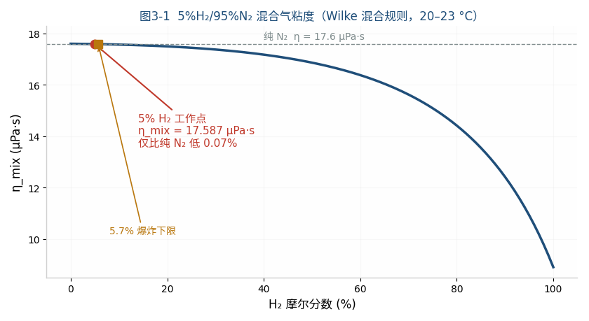
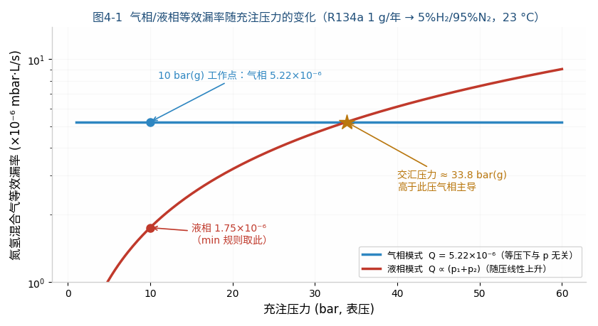
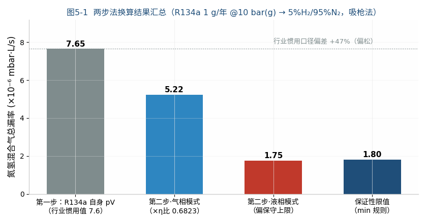

# R134a Refrigerant Annual Leakage ↔ N₂/H₂ Tracer-Gas Leak Rate Equivalence Calculation

**— 5%H₂/95%N₂ tracer gas, gas-phase / liquid-phase dual-mode theoretical derivation (equal-pressure conversion)**

| Item | Content |
|---|---|
| Document No. | RM-CAL-2026-0731-EN |
| Version | V1.0 |
| Date | 2026-07-31 |
| Prepared by | Shanghai Realmeter Instrument Co., Ltd. |
| Author | Xie Fangping |
| Purpose | Theoretical basis for limit setting and instrument configuration of N₂/H₂ tracer-gas leak testing (equal pressure 10 bar(g)) for R134a systems |

---

## 1 Task Statement and Boundary Conditions

**Task**: Convert the R134a annual leakage **1 g/year @ 10 bar(g)** into the equivalent leak rate (mbar·L/s) for hydrogen-nitrogen tracer gas (5% H₂ + 95% N₂, non-flammable safe concentration), with the **tracer gas charged at the same pressure as the refrigerant duty (10 bar(g))**, computed separately for gas-phase and liquid-phase leak modes.

| No. | Boundary condition | Value |
|---|---|---|
| BC-1 | Pressure reference | Gauge pressure; tracer gas and refrigerant at the same 10 bar(g) |
| BC-2 | Test method | N₂/H₂ sniffer method (ambient atmosphere outside, p₂ = 1 atm) as primary; accumulation/vacuum method differences noted separately |
| BC-3 | Tracer gas | 5% H₂ + 95% N₂ mixture (H₂ below the 5.7% lower flammability limit, safe) |
| BC-4 | Leak-point phase | Gas-phase and liquid-phase modes computed separately; limit by the min rule |
| BC-5 | Temperature | 23 °C (296.15 K) |

---

## 2 Physical Properties and Data Sources

| Symbol | Parameter | Value (23 °C) | Source |
|---|---|---|---|
| M_134a | R134a molecular weight | 102.03 g/mol | SDS/REFPROP[^1^] |
| η_v | R134a vapour dynamic viscosity | 12.0 µPa·s | Saturated vapour at 25 °C: 12.1–12.2 µPa·s (REFPROP family)[^2^][^3^]; literature range 11.77–12.2 µPa·s[^4^]; 12.0 µPa·s adopted |
| η_l | R134a saturated liquid viscosity | 195 µPa·s | 0.195 mPa·s at 25 °C (REFPROP family)[^3^]; literature table 190.46 µPa·s[^4^]; 195 µPa·s adopted |
| ρ_l | R134a saturated liquid density | 1207 kg/m³ | 1207 kg/m³ at 25 °C (REFPROP family)[^3^] |
| p_sat | R134a saturation pressure at 23 °C | ≈ 6.3 bar(abs) | 6.654 bar(abs) at 25 °C[^3^]; 23 °C ≈ 6.3 bar(abs) via Clausius–Clapeyron |
| η_N2 | Nitrogen dynamic viscosity | 17.6 µPa·s | Measured 1.76×10⁻⁵ Pa·s at 20 °C[^5^]; Sutherland 20→23 °C correction (+0.5%) negligible |
| η_H2 | Hydrogen dynamic viscosity | 8.9 µPa·s | Measured 0.89×10⁻⁵ Pa·s at 20 °C[^5^] |
| M_N2 / M_H2 | N₂/H₂ molecular weight | 28.014 / 2.016 g/mol | Standard atomic weights (Wilke inputs) |
| R | Molar gas constant | 8.314 J/(mol·K) | CODATA |
| T | Calculation temperature | 296.15 K | BC-5 (23 °C) |
| η_mix | 5%H₂/95%N₂ mixture viscosity | **17.59 µPa·s** | Computed herein by the Wilke mixing rule (§3.2) |

**Notes on value selection**:
1. The 2 K gap between 23 °C and the 25 °C literature data is small: the R134a vapour-viscosity temperature coefficient is about +0.03 µPa·s/K, liquid viscosity about −2%/K — both within the cited literature ranges. Representative values are adopted directly; the residual deviation is already covered by the §7 uncertainty budget (±3–5%). Per-degree interpolation is deliberately avoided to prevent false precision.
2. The 20→23 °C difference for N₂/H₂ viscosities is <1%, below the Wilke rule's own uncertainty (±2%); the 20 °C values are used as-is.
3. **Reliability grading**: REFPROP states R134a viscosity uncertainty of 3% (liquid) and 3–5% (vapour)[^6^]; N₂/H₂ viscosities are classical measured values (<1%); the mixture viscosity uses the Wilke semi-empirical mixing rule (well validated on hydrocarbon/hydrogen blends[^7^]).

---

## 3 Theoretical Model

### 3.1 Flow-regime criterion (same as the R1234yf calculation book, abbreviated)

The equivalent leak-channel diameter is about 1–2 µm; at 10 bar, Kn ≈ 0.005 ≪ 0.01 — the flow in the channel is **continuum viscous (laminar) flow**, so the compressible laminar formula applies. Misusing the molecular-flow formula would overestimate by about 10×.

### 3.2 Tracer-gas viscosity: Wilke mixing rule (worked in full)

$$\eta_{mix}=\sum_{i}\frac{x_i\,\eta_i}{\sum_j x_j\,\phi_{ij}},\qquad \phi_{ij}=\frac{\left[1+\left(\eta_i/\eta_j\right)^{1/2}\left(M_j/M_i\right)^{1/4}\right]^2}{\sqrt{8\left(1+M_i/M_j\right)}}$$

Inputs: x_H₂ = 0.05, x_N₂ = 0.95, η_H₂ = 8.9 µPa·s, η_N₂ = 17.6 µPa·s, M_H₂ = 2.016, M_N₂ = 28.014 g/mol.

**Step 1: combination parameters φ_ij** (φ_ii ≡ 1):

$$\phi_{H_2,N_2}=\frac{\left[1+\left(8.9/17.6\right)^{1/2}\left(28.014/2.016\right)^{1/4}\right]^2}{\sqrt{8\left(1+2.016/28.014\right)}}=\frac{[1+0.7110\times1.9318]^2}{\sqrt{8.576}}=\frac{5.633}{2.928}=1.9229$$

$$\phi_{N_2,H_2}=\frac{\left[1+\left(17.6/8.9\right)^{1/2}\left(2.016/28.014\right)^{1/4}\right]^2}{\sqrt{8\left(1+28.014/2.016\right)}}=\frac{[1+1.4063\times0.5177]^2}{\sqrt{119.17}}=\frac{2.987}{10.917}=0.2736$$

**Step 2: denominator terms**:

$$\sum_j x_j\phi_{H_2,j}=0.05\times1+0.95\times1.9229=1.8768$$
$$\sum_j x_j\phi_{N_2,j}=0.05\times0.2736+0.95\times1=0.9637$$

**Step 3: weighted sum**:

$$\eta_{mix}=\frac{0.05\times8.9}{1.8768}+\frac{0.95\times17.6}{0.9637}=0.2371+17.3501=17.587\ \;\mu\mathrm{Pa\,s}\approx17.59\ \;\mu\mathrm{Pa\,s}$$

(Although hydrogen's viscosity is only half that of nitrogen, its molecular weight is 14× lower, and the Wilke weight φ_N₂,H₂ = 0.274 strongly suppresses its contribution — this is the quantitative reason why "5% hydrogen barely changes the viscosity".)

**Fig. 3-1**  Mixture viscosity vs H₂ mole fraction computed by the Wilke rule. The working point (5%) and the lower flammability limit (5.7%) lie almost on top of each other and next to the pure-N₂ end; viscosity drops significantly only near 100% H₂. The effect of 5% hydrogen (−0.07%) is far below the viscosity-data uncertainty itself (±2–5%).

**Key physical conclusion**: 5% hydrogen hardly changes the mixture viscosity (only 0.1% below pure N₂) — **the flow behaviour of the N₂/H₂ mixture ≈ pure nitrogen**. Hydrogen only plays the role of a "tracer marker"; all results in this document are expressed as **total mixture leak rates**. Note: hydrogen sensors respond only to the H₂ fraction, so instrument selection must be checked against the manufacturer's actual sensitivity under mixture conditions.

### 3.3 Gas-phase leak mode (equal pressure, ambient outside)

Compressible laminar flow $Q=\dfrac{\pi r^4}{16\eta L}(p_1^2-p_2^2)$; for the same channel the geometry factor cancels. Because tracer gas and refrigerant are at the **same pressure**, with atmosphere on both outer sides, the squared-pressure terms are identical and cancel:

$$\boxed{Q_{N_2/H_2}=Q_{134a}\times\frac{\eta_v}{\eta_{mix}}=\frac{\dot m\,RT}{M_{134a}}\times\frac{\eta_v}{\eta_{mix}}}$$

**This is the minimal form of equal-pressure conversion: in gas-phase mode, tracer-gas leak rate = refrigerant leak rate × viscosity ratio, independent of pressure.**

### 3.4 Liquid-phase leak mode (equal pressure, ambient outside)

Incompressible Hagen–Poiseuille combined with compressible laminar flow, eliminating the geometry:

$$\boxed{Q_{N_2/H_2}=\dot m\times\frac{\eta_l}{2\,\rho_l\,\eta_{mix}}\times\frac{p_1^2-p_2^2}{\Delta p}}$$

Flashing reduces the actual liquid flow below the incompressible model, so this expression is a conservative upper bound.

### 3.5 Limit-setting rule (min rule)

The leak-point phase cannot be known in advance; the limit must guarantee compliance for any phase:

$$Q_{limit}=\min\left(Q_{gas},\ Q_{liquid}\right)$$

---

## 4 Calculation Procedure

### 4.1 Step one: refrigerant pV leak rate (= the industry-customary value)

**Step 1: annual leakage → mass flow rate.** 1 year = 365.25×86400 = 3.15576×10⁷ s:

$$\dot m=\frac{1\times10^{-3}\ \mathrm{kg}}{3.15576\times10^{7}\ \mathrm{s}}=3.1688\times10^{-11}\ \mathrm{kg/s}$$

**Step 2: mass flow → molar flow** (M_134a = 0.10203 kg/mol):

$$\dot n=\frac{3.1688\times10^{-11}}{0.10203}=3.1058\times10^{-10}\ \mathrm{mol/s}$$

**Step 3: ideal-gas law → pV flow rate** (outlet at atmosphere; Q defined as volumetric flow at outlet pressure):

$$Q_{134a}=\dot nRT=3.1058\times10^{-10}\times8.314\times296.15=7.647\times10^{-7}\ \mathrm{Pa\,m^3/s}$$

**Step 4: unit conversion.** 1 mbar = 100 Pa, 1 L = 10⁻³ m³, hence 1 mbar·L/s = 100×10⁻³ = 0.1 Pa·m³/s:

$$Q_{134a}=7.647\times10^{-7}\ \mathrm{Pa\,m^3/s}\times10=7.65\times10^{-6}\ \mathrm{mbar\,L/s}$$

**Dimensional check**: [ṁRT/M] = (kg/s)×(J/(mol·K))×K/(kg/mol) → Pa·m³/s ✓ (J = Pa·m³).

**Cross-check against industry practice**: the INFICON automotive leak-testing e-book explicitly states "1 g/a = 7.6·10⁻⁶ mbar·l/s (only for R134a)"[^9^], consistent with this result. This is the origin of the widely quoted "R134a 1 g/year ≈ 7.7×10⁻⁶ mbar·L/s" — it is the **pV leak rate of the refrigerant medium itself**, before the tracer-medium conversion (step two), and cannot be used directly as the reading or limit of an N₂/H₂ leak detector.

### 4.2 Step two · gas-phase mode (sniffer, equal pressure 10 bar(g))

Viscosity ratio (dimensionless conversion factor):

$$\frac{\eta_v}{\eta_{mix}}=\frac{12.0}{17.587}=0.6823$$

$$Q_{N_2/H_2}=7.647\times10^{-6}\times0.6823=\mathbf{5.22\times10^{-6}\ \;\mathrm{mbar\,L/s}}\ (5.2\times10^{-7}\ \;\mathrm{Pa\,m^3/s})$$

**Physical-direction check**: the R134a molecule is heavier and more polar than N₂, and η_v = 12.0 < η_mix = 17.6, so R134a "flows more easily" through the same channel; the N₂/H₂ pV leak rate corresponding to the same mass leakage is therefore only 68% of the refrigerant's own pV rate — direction is reasonable ✓.

### 4.3 Step two · liquid-phase mode (sniffer, equal pressure 10 bar(g))

**Pressures must be absolute** (both the ideal-gas law and the laminar-flow formula require absolute pressure): p₁ = 10 + 1.01325 = 11.01325 bar(a), p₂ = 1.01325 bar(a), Δp = p₁ − p₂ = 10 bar (gauge equals differential).

**Step 1: medium/geometry factor**:

$$\frac{\eta_l}{2\rho_l\eta_{mix}}=\frac{195\times10^{-6}}{2\times1207\times17.587\times10^{-6}}=4.593\times10^{-3}\ \mathrm{m^3/kg}$$

**Step 2: squared-pressure ratio** (with identity check: (p₁²−p₂²)/(p₁−p₂) ≡ p₁+p₂):

$$\frac{p_1^2-p_2^2}{\Delta p}=p_1+p_2=11.01325+1.01325=12.0265\ \mathrm{bar}=1.20265\times10^{6}\ \mathrm{Pa}$$

Numerical verification: (11.01325² − 1.01325²)/10 = (121.292 − 1.027)/10 = 12.0265 ✓ (consistent with the p₁+p₂ identity).

**Step 3: synthesis**:

$$Q_{N_2/H_2}=3.1688\times10^{-11}\times4.593\times10^{-3}\times1.20265\times10^{6}=1.750\times10^{-7}\ \mathrm{Pa\,m^3/s}=\mathbf{1.75\times10^{-6}\ \mathrm{mbar\,L/s}}$$

**Reverse check**: from Q = 1.75×10⁻⁶ mbar·L/s back to ṁ = Q/(4.593×10⁻³×1.20265×10⁶)×0.1 = 3.17×10⁻¹¹ kg/s = 1.00 g/year ✓ (closed loop).

### 4.4 If the vacuum / accumulation method is used (vacuum outside)

The squared-pressure terms no longer cancel; multiply by:

$$\frac{p_1^2}{p_1^2-p_2^2}=\frac{11.01325^2}{11.01325^2-1.01325^2}=\frac{121.292}{120.265}=1.00854$$

i.e. gas phase 5.22×1.0085 = 5.26×10⁻⁶, liquid phase 1.75×1.0085 = 1.765×10⁻⁶ mbar·L/s; the difference is <1%, negligible in engineering.

### 4.5 Pressure dependence and crossover pressure

Generalising §4.2/§4.3 to any charge pressure p_g (gauge): in gas-phase mode the squared-pressure terms cancel and the equivalent rate is pressure-independent; in liquid-phase mode the ratio ≡ p₁+p₂ = (p_g+2.0265) bar rises linearly with pressure. Setting the two expressions equal (ṁ and η_mix cancel on both sides): $\dfrac{\eta_l}{2\rho_l}(p_1+p_2)=\dfrac{RT\,\eta_v}{M}$, giving:

$$p_1+p_2=\frac{2\rho_l\,\eta_v\,RT}{\eta_l\,M}=\frac{2\times1207\times12.0\times10^{-6}\times8.314\times296.15}{195\times10^{-6}\times0.10203}=3.585\times10^{6}\ \mathrm{Pa}=35.85\ \mathrm{bar}$$

$$p_{g,cross}=35.85-2.0265=\mathbf{33.8\ \mathrm{bar(g)}}$$

(The analytical solution agrees with the numerical scan in Fig. 4-1.)

(Dimensional check: [ρηRT/(ηM)] = (kg/m³)(Pa·s)(J/mol)/(Pa·s)(kg/mol) = (kg/m³)(J/kg) = J/m³ = Pa ✓)

**Fig. 4-1**  Gas-/liquid-phase equivalent leak rates vs charge pressure. The 10 bar(g) working point lies far below the crossover pressure of 33.8 bar(g); the liquid value (1.75×10⁻⁶) is smaller than the gas value (5.22×10⁻⁶), so the min rule takes the liquid value — the general rule that "liquid phase dominates low-pressure refrigerant duties". If the test pressure exceeds 33.8 bar(g), the dominant mode reverses to gas phase and the limit should take the gas-phase value instead.

---

## 5 Results Summary and Discussion

| Level | Total mixture leak rate (sniffer, 10 bar(g)) | Note |
|---|---|---|
| Step one: R134a own pV rate (industry-customary value[^9^]) | 7.6×10⁻⁶ mbar·L/s | Mass→pV conversion only, no medium correction; cannot serve directly as the N₂/H₂ limit |
| Step two · gas-phase leak | **5.2×10⁻⁶ mbar·L/s** | = refrigerant rate × viscosity ratio 0.6823 |
| Liquid-phase leak | **1.75×10⁻⁶ mbar·L/s** | Conservative upper bound |
| **Guaranteeing limit (min rule)** | **≈ 1.8×10⁻⁶ mbar·L/s** | False-reject band 2.98× |

**Fig. 5-1**  Summary of the two-step results. Grey bar: industry-customary figure (step one only, no medium correction); blue/red bars: rigorous values; dark-blue bar: guaranteeing limit. The customary figure deviates +47% from the rigorous gas-phase value (lenient direction).

Discussion:

0. **Deviation of the customary value**: using 7.6×10⁻⁶ directly as the N₂/H₂ test limit implicitly assumes η_R134a = η_N₂/H₂, a +47% deviation that would pass parts leaking 1.47 g/year in gas phase — lenient, not conservative; suitable only for quick estimation and communication.
1. **Liquid phase dominates the limit**: the gas/liquid ratio is 2.98×, almost identical to the R1234yf @10 bar duty (2.9×) — 10 bar is far below the crossover pressure; liquid dominance is the general rule for low-pressure refrigerant duties.
2. **Quantitative comparison with helium testing**: for the same specification, the R1234yf helium gas-phase conversion is 4.0×10⁻⁶ (η ratio 11.46/19.6 = 0.585), while R134a N₂/H₂ gives 5.2×10⁻⁶ (η ratio 12.0/17.59 = 0.682). Same order of magnitude, but the N₂/H₂ method's **sensor-side signal is diluted to 5%**, so the equivalent detection-sensitivity requirement is about 20× more stringent than helium.
3. **Instrument sensitivity check**: by the engineering convention "instrument resolution ≤ 1/10 of the limit", the leak-test system must stably resolve a **total mixture leak rate of 1.8×10⁻⁷ mbar·L/s**. The sniffer method suffers dilution of the leaking gas by the sniffer flow (typically losing 1–2 orders of magnitude), and the hydrogen sensor responds only to the 5% H₂ fraction — selection must strictly follow the manufacturer's mixture-condition sensitivity specification; switch to the accumulation method for compensation if necessary.

---

## 6 Leak-Test System Design Recommendations

| Item | Value |
|---|---|
| Guaranteeing reject limit (total mixture) | **1.8×10⁻⁶ mbar·L/s** |
| (Alternative) known gas-phase-zone limit | 5.2×10⁻⁶ mbar·L/s |
| Minimum detectable leak rate (limit/10) | 1.8×10⁻⁷ mbar·L/s (total mixture) |
| Tracer gas charge | 5% H₂ + 95% N₂, 10 bar(g) |
| Calibration reference leak | A 5%H₂/95%N₂ reference leak around 1.8×10⁻⁶ mbar·L/s (calibrated at 23 °C) is recommended, or convert from a He reference leak (×η_He/η_mix = 1.11) |

Additional recommendations:

1. **Method selection**: at this specification the sniffer signal-to-noise ratio is weak (sniffer dilution + hydrogen sensor responding only to the H₂ fraction); the **accumulation method** (closed hood accumulation with hydrogen-sensor concentration-growth reading) is recommended, improving SNR by 1–2 orders of magnitude;
2. **False-reject band management**: same three options as Chapter 6 of the R1234yf calculation book (min-rule default / phase demarcation / zone testing); band width 2.98×;
3. **Temperature correction**: 23 °C reference; ±10 °C drift affects the viscosity ratio by <2%;
4. **Check against R134a saturation pressure**: saturation pressure at 23 °C is 6.3 bar(abs); at 10 bar(g) the subcooling is about 4.7 bar, so the liquid-phase model holds.

---

## 7 Uncertainty Analysis

| Source | Magnitude | Impact |
|---|---|---|
| η_v (R134a vapour) | ±3–5% (REFPROP statement)[^6^] | Gas phase ±5% |
| η_l, ρ_l (liquid) | ±3% (REFPROP liquid viscosity) | Liquid phase ±4% |
| η_mix (Wilke rule) | ±2% | All modes ±2% |
| Temperature (23±5 °C) | <2% | Negligible |
| Flashing effect (liquid) | One-sided, conservative | Liquid value is an upper bound |
| **Phase uncertainty (limit direction)** | Systematic, 2.98× | **Dominant factor**, covered by the min rule |

**Combined expanded uncertainty (k=2): gas phase ≈ ±6%, liquid phase ≈ ±8%.** A ≥20% engineering margin on the limit is recommended.

---

## 8 Conclusions: The Theoretical Position of the Industry-Customary Value and Its Usability Boundary

### 8.1 The numerical lineage (logic of all results in this document)

| Level | Value (mbar·L/s) | Physical meaning |
|---|---|---|
| ① Industry-customary value (INFICON figure[^9^]) | 7.6×10⁻⁶ (= 7.6×10⁻⁷ Pa·m³/s) | The **refrigerant's own** pV leak rate: only the "mass → pV" step-one conversion |
| ② Rigorous value · gas phase | 5.22×10⁻⁶ | ① × viscosity ratio 0.6823 (step-two medium conversion) |
| ③ Rigorous value · liquid phase | 1.75×10⁻⁶ | Conservative upper bound |
| ④ Guaranteeing limit (min rule) | ≈ 1.8×10⁻⁶ | Design limit when the phase is unknowable |

### 8.2 What is wrong with the INFICON figure

"R134a 1 g/year = N₂/H₂ leak test 7.6×10⁻⁶ mbar·L/s" — the most widely circulated figure in the industry — **is, strictly speaking, not correct: it completes only half of the conversion**. After converting the annual refrigerant mass loss into the refrigerant's own pV leak rate (step one), it takes that number directly as the N₂/H₂ leak rate, omitting the step-two medium conversion. The implicit assumption is η_R134a = η_N₂/H₂, whereas in fact 12.0 ≠ 17.6 µPa·s — a 47% difference. Used directly as the N₂/H₂ test limit, 7.6×10⁻⁶ would pass parts leaking up to 1.47 g/year in gas phase — **the deviation is lenient, not conservative**.

### 8.3 Why this "wrong number" has been used for decades without causing problems

Not because the conversion happens to be right, but because **the margin structure of the specification absorbs the conversion error entirely**, with three layers of buffering:

1. **First layer: the specification itself is set very high.** 1 g/year is the customary industry specification, while the functional-failure threshold of a refrigerant system (the cumulative leakage needed for noticeable capacity loss) is of order ~150 g/year — about **two orders of magnitude** of margin. A +47% limit deviation is a rounding error against two orders of magnitude.
2. **Second layer: production leak rates are bimodally distributed.** Sound parts cluster around ~10⁻¹⁰ mbar·L/s, defective parts around ~10⁻² mbar·L/s, with a "no-man's land" of about 8 orders of magnitude in between. Whether the limit sits at 1.8×10⁻⁶ or 7.6×10⁻⁶, it falls inside that gap — **the accept/reject outcome for any real part is identical**.
3. **Third layer: even a false pass is harmless.** The worst-case boundary part released under 7.6×10⁻⁶ leaks 1.47 g/year — still two orders of magnitude below the functional threshold, with no practical consequence within the warranty period.

In other words: **the customary value is a "wrong but harmless" number** — it uses only half the theory, yet is thoroughly protected by the excess margin of the specification.

### 8.4 When the rigorous values must be used instead

Margins are not infinitely thick. In the following situations the buffer thins and the +47% deviation of the customary figure can have real consequences; the rigorous values (②③④) of this document should be used:

- **Certification, traceability, and customer audits**: the limit must withstand theoretical review; the step-one figure cannot justify itself;
- **Tightened specifications or new refrigerants**: e.g. low-charge R1234yf systems and A2L mildly flammable refrigerants (where the cabin concentration limit becomes the real bottom line) compress the margin from two orders of magnitude to below one — a ±50% limit-setting error is no longer negligible;
- **Limit setting in liquid-dominated duties**: at 10 bar(g) the rigorous liquid value (1.75×10⁻⁶) is 4.3× tighter than the customary figure; when the phase is unknowable, the min rule applies — otherwise there is a 4.3× lenient false-pass risk for liquid-phase leakers.

### 8.5 One-sentence conclusion

**7.6×10⁻⁷ Pa·m³/s is the communication figure; 1.8×10⁻⁶ mbar·L/s (min rule) is the design limit**: the former comes from a half-completed conversion and has remained harmless only thanks to the specification's margin; the latter is the rigorous value from the complete two-step conversion with phase analysis. Use the former in everyday communication; use the latter for leak-test system design and audit documentation.

---

## Appendix A Symbols

| Symbol | Meaning | Unit |
|---|---|---|
| Q | Leak rate (pV flow rate) | Pa·m³/s or mbar·L/s |
| ṁ, ṅ | Mass / molar flow rate | kg/s, mol/s |
| η_v, η_l, η_mix | Vapour / liquid / mixture viscosity | Pa·s |
| ρ_l | Liquid density | kg/m³ |
| x_i, M_i | Mole fraction / molecular weight | —, g/mol |
| p₁, p₂, Δp | Inlet / outlet absolute pressure / differential | Pa |

## Appendix B References

[^1^]: National Refrigerants, Inc. Safety Data Sheet R-134a: Molecular Weight 102. https://refrigerants.com/wp-content/uploads/2019/12/SDS-R134a.pdf
[^2^]: Viscosity of R134a in the Vapor Phase, Near Saturation (298.06 K: 12.2 µPa·s; 303.32 K: 12.4 µPa·s). https://core.ac.uk/download/pdf/61420255.pdf
[^3^]: RSL/REFPROP v10 data sheet: R134a Vapour Viscosity (25°C & 1 bara) 0.0121 cP; Liquid Viscosity (25°C) 0.1949 cP; Liquid Density (25°C) 1207 kg/m³; Vapour Pressure (25°C) 6.654 bara. https://refsols.com/RS-20.html
[^4^]: UPC literature data sheet: R134a Liquid Viscosity 190.46 µPa·s, Vapor 11.77 µPa·s (approx. 25 °C). https://upcommons.upc.edu/bitstreams/6f05d6e9-1996-4f46-8ebf-95e776fc4bd2/download
[^5^]: Effect of the Physical Properties of Testing Gases on the Leak Test Results of Polyethylene Pipe Assemblies. *Applied Sciences*, 2026, 16(14): 7219. (Table 1: N₂ 1.76×10⁻⁵ Pa·s, H₂ 0.89×10⁻⁵ Pa·s @20 °C) https://www.mdpi.com/2076-3417/16/14/7219
[^6^]: Etude des propriétés thermodynamiques des nouveaux fluides frigorigènes. Ph.D. Thesis, 2016. (REFPROP 9.0 statement: R134a viscosity uncertainty 3% liquid, 3–5% vapour) https://pastel.hal.science/tel-01804996/file/2016PSLEM089_archivage.pdf
[^7^]: Viscosity of Hydrogen-Enriched Natural Gas Blends (xH2 = 0, 5, 20, 50, and 80%) from 223 to 323 K and up to 30 MPa. *J. Chem. Eng. Data*, 2025. https://pubs.acs.org/doi/10.1021/acs.jced.5c00401
[^9^]: INFICON. Leak Testing in the Automotive Industry (e-book): "1 g/a = 7.6·10⁻⁶ mbar·l/s (only for R134a)". https://www.inficon.com/media/7992/download/-Portals-0-PDF-ebooks-INFICON_E-Book_LeakTestingInTheAutomotiveIndustry_mika00en-b_1604.pdf
[^10^]: Pfeiffer Vacuum. Mass Loss Rates and Volume Leak Rates in Laminar or Molecular Flow Regime (two-step conversion: mass flow → medium pV leak rate → medium conversion by flow regime; take the unfavourable case when the regime is unknown). https://www.pfeiffer-vacuum.com/mx/en/knowledge/leak-detection/calculations/mass-loss-rates-and-volume-leakage-rates-in-laminar-or-molecular-flow-regime.html
[^8^]: RM-CAL-2026-0730, *R1234yf Refrigerant Annual Leakage ↔ Helium Leak Rate Equivalence Calculation*. Shanghai Realmeter Instrument Co., Ltd., 2026-07-30. (Same framework for flow-regime criterion, min rule, and crossover pressure.)
